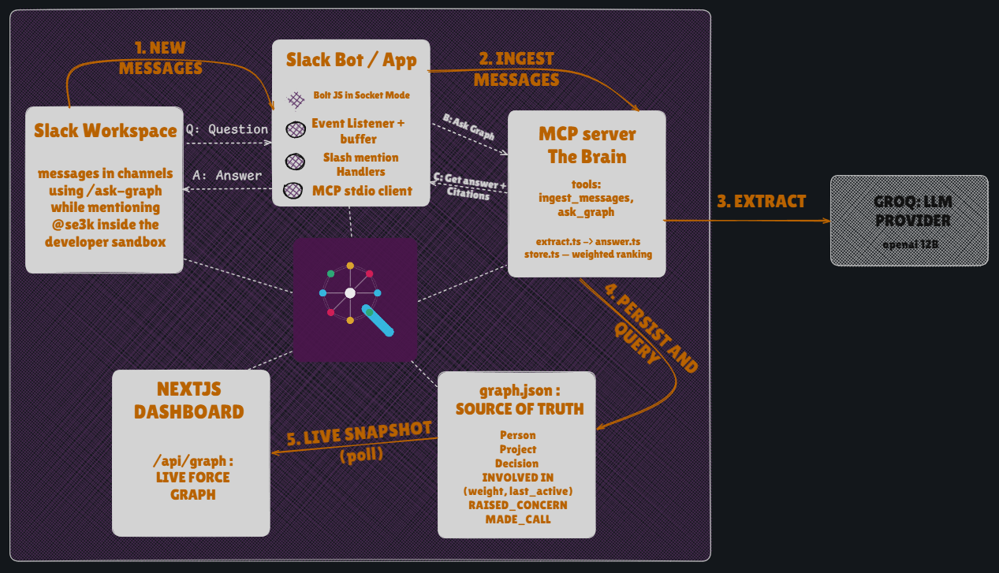

<p align="center">
  
</p>

# SE3K — _"Who actually knows this?"_

> Turn your Slack history into a knowledge graph that surfaces **who really knows about X** — ranked by demonstrated work, not who's assigned — and **why past decisions were made**, with sources.

---

## 💡 Inspiration

Every organization has a quiet, expensive lie baked into its tools: **the person _assigned_ to something is rarely the person who actually knows it.**

Jira says Dana owns rate-limiting. But Dana kicked it off six months ago and moved on. The person who actually traced the 429 storms at 2 a.m., shipped the fix, and has answered every on-call question since is **Mia** — and _nothing_ in your stack knows that. Her expertise is real, but it's scattered across a dozen Slack threads that scrolled off the screen weeks ago. It's invisible and unsearchable.

We kept hitting the same wall: **the knowledge is in Slack, but Slack has no memory of who knows what.** A summarizer can recap _one_ thread. A ticket tracks _formal_ ownership. Neither can answer the question you actually ask a teammate in the hallway: _"Hey, who do I talk to about this?"_

So we built the thing that reads between the threads.

---

## 🎯 The Problem (intuitively)

There are two questions that are impossible for both a plain LLM (no cross-conversation memory) and Jira (only formal assignment) to answer well:

1. **Expertise routing** — _"Who do I talk to about the rate-limiter?"_
   → Not the assignee. The person with the deepest **demonstrated** involvement, ranked and cited.

2. **Decision provenance** — _"Why did we drop the Redis rate-limiter?"_
   → Not just the outcome a closed ticket shows. The **reasoning and the dissent**: who pushed back, on what grounds, and who made the final call.

The test we held ourselves to for every demo question: _could this be answered by reading one Jira ticket or summarizing one thread?_ If yes, it's not worth building. SE3K only earns its existence on the questions that require **memory across many conversations over time.**

---

## 🧠 How it works (and the math that makes it tick)

SE3K continuously reads the channels it's invited to and distills them into a small, opinionated **knowledge graph**:

- **Nodes:** `Person`, `Project`, `Decision` (+ `Channel` for citations)
- **Edges:** `INVOLVED_IN` (the star of the show), `RAISED_CONCERN`, `MADE_CALL`, `RELATES_TO`

The entire idea of "who _actually_ knows this" lives in one weighted, time-stamped edge:

$$
\text{Person} \xrightarrow[\;(w,\; t_{\text{last}})\;]{\textbf{INVOLVED\_IN}} \text{Project}
$$

An LLM extraction pass turns raw messages into these edges and — crucially — assigns each contribution a **weight** by _what the person actually did_, not how loudly they typed:

$$
w_{\text{msg}} =
\begin{cases}
4\text{–}5 & \text{posted a fix, debugged the root cause, reviewed/merged the change} \\
2\text{–}3 & \text{substantive back-and-forth, proposed an approach, reproduced the bug} \\
1 & \text{a passing mention, a question, a "+1"} \\
0 & \text{formally assigned but demonstrably did nothing}
\end{cases}
$$

A person's involvement in a project is the **accumulation** of every contribution we've seen:

$$
W(p, \text{proj}) = \sum_{i \in \text{contributions}} w_i
\qquad
t_{\text{last}} = \max_i \; t_i
$$

But raw weight alone is a trap — it would crown someone who was heavily involved a year ago and has since vanished. Expertise **decays**. So the final ranking score applies exponential recency decay with a 30-day half-life:

$$
\text{recency} = \left(\tfrac{1}{2}\right)^{\Delta t / \tau}, \qquad \Delta t = t_{\text{now}} - t_{\text{last}}, \quad \tau = 30 \text{ days}
$$

$$
\boxed{\; \text{score}(p) = W(p,\text{proj}) \cdot \big(0.4 + 0.6 \cdot \text{recency}\big) \;}
$$

The $0.4 + 0.6(\cdot)$ shape means **weight always dominates** (deep past work never fully disappears), while recency **breaks ties** in favor of whoever's still hands-on. Rank $\text{score}(p)$ descending and the top node _is_ your expert — with the exact messages that prove it attached as sources.

Decision provenance reuses the same graph: for a `Decision` node we walk its inbound `RAISED_CONCERN` and `MADE_CALL` edges to reconstruct the debate, dissent, and the final call — each with its quote.

---

## 🏗️ How we built it

SE3K is three cooperating services, wired so that **the MCP server is the brain** and everything else is I/O:

<p align="center">
  
</p>

- **Ingestion** — Bolt listens for messages, buffers them per channel, and flushes batches to the MCP `ingest_messages` tool. The extraction prompt (kept in one testable place) returns strict JSON, which we merge into the graph with entity resolution (dedupe by Slack user ID first, then normalized name).
- **The brain is an MCP server** — the Slack bot connects to it as a genuine **MCP stdio client**, so the ingestion + reasoning is a reusable tool surface, not glue buried inside the bot.
- **Grounded answering** — we never let the model free-associate over the graph. We resolve the relevant subgraph _deterministically in code_, then hand the model only those grounded facts to phrase. Every answer carries citations; when the graph lacks signal, SE3K says so instead of hallucinating.
- **Provider-agnostic LLM** — an OpenAI-compatible client pointed at **Groq** (`llama-3.1-8b-instant`) by default, swappable via env. With no key, the demo still answers from a seeded graph — our insurance policy for a live demo.
- **The dashboard** — a Next.js app renders the live graph with `react-force-graph`, polling `/api/graph`, color-coded by node type and sized by involvement, so judges can _see_ the org's knowledge network grow.
- **Semantic answer cache** — before spending a single token, `ask_graph` embeds the question (Jina) and returns a cached answer for any _semantically-similar_ question asked against the same graph — **zero LLM calls**. It self-invalidates the instant the graph changes, so repeated or reworded questions are served instantly and never go stale.

### The commands

| Command                 | What it does                                                                                        |
| ----------------------- | --------------------------------------------------------------------------------------------------- |
| `/ask-graph [question]` | Answers expertise-routing **and** decision-provenance questions in-channel, ranked and sourced.     |
| `@se3k [question]`      | Same brain, conversational — replies in-thread next to the discussion.                              |
| `/se3k-ingest`          | Forces an immediate flush of pending messages into the graph (great for "watch it update" moments). |

---

## 🧪 A worked example

We seeded a workspace with a deliberately tricky scenario. `#backend` shows Dana _assigned_ to rate-limiting long ago, then Mia doing the real work, and Leo reviewing it:

```
> /ask-graph who do I talk to about rate limiting?

Talk to Mia Chen about API gateway rate limiting. She has the deepest
hands-on involvement (score 12.6) — she traced the 429 storms and shipped
the in-process token bucket (p99 180ms → 22ms). Runner-up: Leo Martins.

Sources:
 • #backend — "Shipped the in-process token bucket; p99 dropped from 180ms to 22ms."
 • #backend — "Reviewed and merged the token-bucket PR; suggested the jitter window."
```

Why Mia and not Dana? Plug into the formula above: Mia's recent hands-on work scores **≈ 12.6**, while Dana's lone stale kickoff (6 months old) scores **≈ 0.42** — a **~30× gap**, exactly the difference between "owns the ticket" and "actually knows the system." Provenance falls out of the same graph:

```
> /ask-graph why did we drop the redis rate limiter?

Decision: drop the Redis-backed limiter for an in-process token bucket.
Sam Reyes raised a concern (limits drift across pods without shared state);
Leo asked about losing bucket counts on pod restart. Mia made the final call:
per-pod buckets are fine — limits are advisory, and Redis latency was the
real outage cause.
```

---

## 🧗 Challenges we faced

- **Making extraction _discriminate_, not just _list_.** Our first prompt happily gave everyone who typed in a thread an `INVOLVED_IN` edge — which is useless. The breakthrough was making the _weight rubric_ explicit and adversarial: a person "formally assigned who does not actually contribute gets low or no involvement." Demonstrated work beats assignment is not a vibe; it's an instruction in the prompt.
- **Entity resolution.** "Sri", "Srijan", and `U_SRIJAN` are one person. We normalize by Slack user ID wherever possible and fall back to a slugged-name match, so the graph doesn't fracture one expert into three weak nodes.
- **Trust.** An unsourced answer from a bot is worthless. Forcing every edge to carry its originating message — and resolving the subgraph in code before the LLM ever speaks — is what lets SE3K cite instead of confabulate.
- **A genuinely painful frontend bug.** The live dashboard polled every few seconds, and the force-graph **re-heated its physics simulation on every poll** — nodes flew around like the page was constantly reloading. The fix was two-fold: (1) skip all work when the snapshot is byte-identical, and (2) preserve node object _identity_ across polls so the engine keeps settled $(x, y)$ positions, only swapping the data reference when the node/link _set_ actually changes. Stable identity → a calm graph.
- **Wiring the bot to the brain over MCP stdio** (spawning the server as a child process, marshalling tool calls) took real fiddling, but it's what makes the ingestion/reasoning a clean, reusable MCP tool surface instead of a monolith.

---

## 📚 What we learned

- **Weighted, decaying edges are a tiny idea with outsized payoff.** One well-designed edge — $\text{weight} \times \text{recency}$ — is the whole difference between "search" and "knows who knows."
- **Ground first, phrase second.** The reliable pattern for LLM answers isn't a bigger prompt; it's doing the retrieval deterministically and letting the model only _narrate_ facts it can't invent.
- **MCP is a great seam.** Treating the graph brain as an MCP server made the Slack bot, a CLI tester, and the dashboard all just different clients of the same tools.
- **Prompt engineering is adversarial.** You don't get good extraction by asking nicely — you get it by writing the rubric that punishes the failure mode you actually fear (assignment ≠ expertise).
- **Cache on meaning, not strings.** Embedding questions and matching on cosine similarity — tagged with a graph-content version for invalidation — turns repeated and reworded asks into instant, LLM-free answers. A big cost + latency win for almost no code.

---

_SE3K, for the Slack Agent Builder Challenge. Unlike a summarizer, it persists across time. Unlike Jira, it captures what was never formally recorded._
