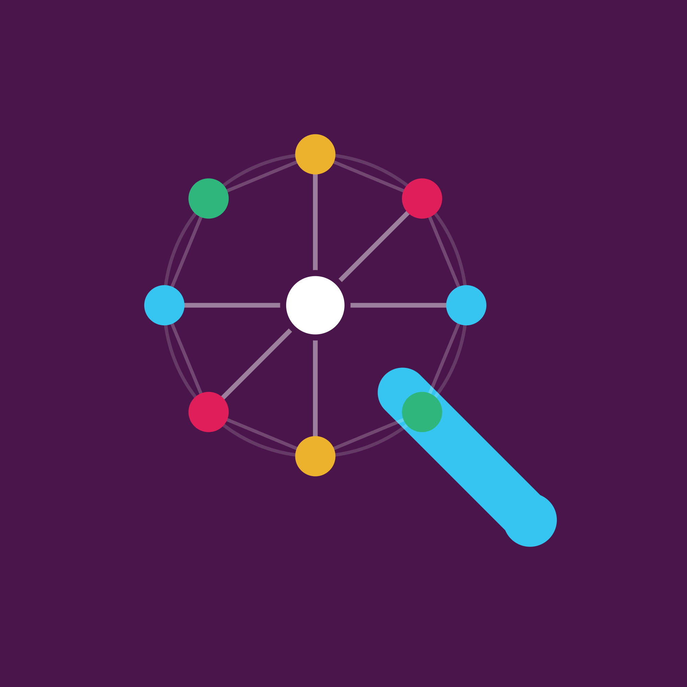
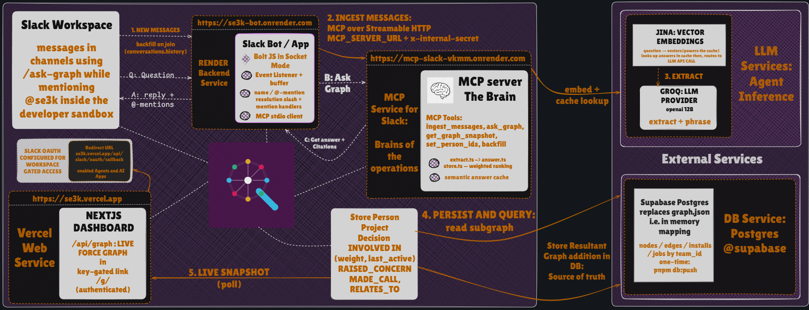

<p align="center">
  
</p>

# SE3K — _"Who actually knows this?"_

> An org brain that lives in Slack. It surfaces **who really knows about X**,
> ranked by demonstrated work rather than who's assigned, and **why past decisions
> were made**, with receipts.

---

## 💡 The problem

Every team has the same quiet, expensive lie baked into its tools: **the person
_assigned_ to something is rarely the person who actually knows it.**

Jira says Dana owns rate-limiting. But Dana kicked it off months ago and moved on.
The person who traced the outage at 2 a.m., shipped the fix, and has answered every
question since is someone else entirely, and _nothing_ in your stack knows that.
Their expertise is real, but it's scattered across a dozen threads that scrolled
off the screen weeks ago. Invisible. Unsearchable.

A summarizer recaps _one_ thread. A ticket tracks _formal_ ownership. Neither can
answer the question you actually ask a teammate in the hallway: _"who do I talk to
about this?"_ So we built the thing that reads between the threads and remembers.

## 🎯 What you can ask it

- **Who do I talk to about X?** The person with the deepest _demonstrated_
  involvement (traced it, fixed it, reviewed it, recently), **not** the formal owner.
- **Why did we decide X?** The reasoning _and the dissent_: who pushed back, on
  what grounds, and who made the final call.
- **What is @Priya working on?** That person's real work, and no one else's.
- **Who's doing what?** A one-line-per-project status of the whole team.

It answers right in Slack, **@-mentions** the people it names, **links every claim
to the exact message**, and when it doesn't know, it _says so_ instead of inventing.

## ✨ What makes it feel real

- **Ranks by proof, not assignment.** A weighted, time-decaying edge means the
  person who did the work outranks the person who's "assigned."
- **Every answer is sourced.** Each citation is a clickable link straight to the
  Slack message. Trust, but verify.
- **Instant repeat answers.** A semantic cache (via [Jina](https://jina.ai/embeddings))
  recognizes a reworded question and answers with **zero LLM calls**, then
  self-invalidates the moment new messages land, so it's never stale.
- **One-click install, any workspace.** Slack OAuth from the dashboard connects a
  new workspace in a click. Each gets its own isolated graph — no shared state,
  no cross-workspace bleed.
- **Catches up on years, not just today.** Invite the bot and it starts learning
  immediately, but a workspace that's been running for years doesn't have to start
  from zero: a one-click backfill job walks its **entire** channel history (not
  just the last few hundred messages) with live progress in the dashboard.
- **Handles giant threads.** A 200-message thread is split, processed, and merged,
  never choking the context window.
- **Human-proof.** Ignores banter and emoji, but catches "I'll pick up the billing
  work next" as a real signal.
- **Live graph dashboard.** Watch the org's knowledge network grow in real time.

## 🧠 How it decides who's the expert

The whole idea lives in one weighted, timestamped edge: `Person → Project`. An LLM
reads each message and scores the contribution by _what the person actually did_.
Shipping a fix or debugging the root cause is worth a lot; a "+1" or being the
formal owner who never showed up is worth almost nothing.

A person's score is the **accumulation of everything they've done, decayed by
recency** (30-day half-life), so deep past work still counts, but whoever's
hands-on _now_ wins ties. Rank that score and the top person _is_ your expert, with
the messages that prove it attached. Decision provenance reuses the same graph:
walk a decision's "raised a concern" and "made the call" edges to reconstruct the
debate.

That's the part no ticket tracker or summarizer can do: it needs **memory across
many conversations over time.**

## 🏗️ How we built it

Three small services, wired so the **MCP server is the brain** and everything else
is I/O — now a persistent, multi-workspace service instead of a single-tenant
sidecar:

<p align="center">
  
</p>

- **The bot** (Bolt, Socket Mode) is a genuine **MCP client**: it talks to the brain
  over Streamable HTTP and calls its tools, so ingestion and reasoning stay a
  reusable surface, not glue. It authorizes per-message via a Slack `team_id`
  lookup instead of one static bot token, so a single running bot process serves
  every installed workspace at once.
- **The brain** (MCP server) now runs as a persistently-reachable service: MCP
  tool calls from the bot and REST calls from the dashboard hit the same process.
  It uses an LLM to extract structured entities from messages and to phrase
  answers, but it **never lets the model free-associate.** It resolves the facts
  from the graph in code first, then asks the model only to word them — that's
  what lets it cite instead of hallucinate.
- **Storage moved to Postgres (Drizzle)**, partitioned by workspace: every node,
  edge, installed bot token, and backfill job is keyed by `team_id`, so
  workspaces are fully isolated and a message is never double-counted whether it
  arrives live or via backfill.
- **Provider-agnostic**, defaults to **Groq** (`llama-3.1-8b-instant`); with no key
  at all it still answers from a seeded graph.
- **The dashboard** (Next.js + react-force-graph) is also where a workspace gets
  connected: a real Slack OAuth install flow, a picker for which channels to
  backfill (or auto-join every public one), and a live progress view — on top of
  the same force-directed graph, colored by type and sized by involvement.

_For the challenge:_ **MCP** is the whole ingestion and query brain, now served
over Streamable HTTP so both the bot and the dashboard are its clients; **Slack
AI** is the in-Slack agent; and history backfill covers both zero-effort on-join
catch-up (`conversations.history`) and an explicit, paginated full-history job
triggered from the dashboard for workspaces installing after years of activity.

## 🧪 See it in action

Seed a channel with a scenario where **Ivan** quietly does the work while **Adam**
owns checkout on paper:

```
> who do I talk to about the checkout timeouts?

Talk to @Ivan Sanders. He traced it to Postgres connection-pool exhaustion and
shipped PgBouncer (checkout p95 9s → 700ms). Adam owns the service on paper but
handed it off, so he's not your best bet here.
  • #backend: "Shipped PgBouncer connection pooling; p95 dropped 9s → 700ms"
```

Ask _why_, and the same graph gives you the debate, not just the outcome:

```
> why did we adopt PgBouncer?

Pool exhaustion was the real outage cause. @Adam Reyes pushed back that it's one
more service to run and monitor; @Ivan Sanders made the final call to keep it and
add monitoring.
```

Same question, worded differently five minutes later? Served instantly from cache,
zero tokens. New messages posted? The cache quietly forgets and re-answers fresh.

## 🧗 What was hard

- **Making extraction _discriminate_, not just _list_.** The first prompt gave
  everyone who typed an edge, which is useless. The fix was an explicit, adversarial
  weight rubric: assigned-but-absent gets a 1, the person who shipped it gets a 5.
- **Trust.** An unsourced bot answer is worthless. Forcing every edge to carry its
  originating message, and resolving the subgraph _before_ the LLM speaks, is what
  makes citations real.
- **A calm live graph.** The dashboard re-heated its physics on every poll, so nodes
  flew around like the page was reloading. Fix: skip identical polls and preserve
  node identity so settled positions stick.
- **Backfill and live ingestion racing each other.** Once history backfill could
  run as its own job, the same message could get extracted twice — once live,
  once from history — silently doubling its weight. Fixed with a
  `(team, channel, ts)` idempotency table that only commits _after_ a successful
  ingest, so a flaky LLM call skips a batch instead of permanently losing or
  double-counting it.

## 📚 What we learned

- **Weighted, decaying edges are a tiny idea with outsized payoff:** one good edge
  is the whole difference between "search" and "knows who knows."
- **Ground first, phrase second.** Reliable LLM answers come from doing the retrieval
  deterministically and letting the model only _narrate_ facts it can't invent.
- **MCP is a great seam:** the bot, a CLI tester, and the dashboard are all just
  clients of the same brain.
- **Cache on meaning, not strings:** embedding questions turns reworded asks into
  instant, LLM-free answers for almost no code.

---

_Unlike a summarizer, SE3K persists across time. Unlike Jira, it captures what was
never formally recorded._ · See [se3k/TESTING.md](se3k/TESTING.md) to run it yourself.
