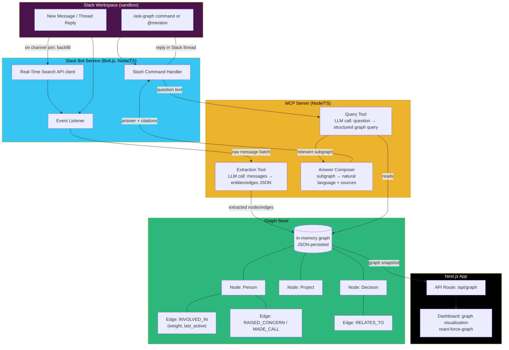
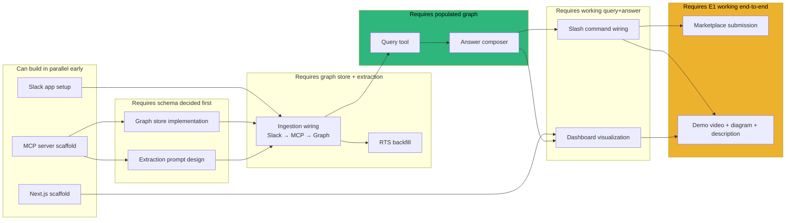
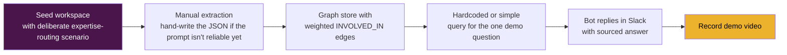

# TECHNICAL_ARCHITECTURE.md — SE3K

_"Who actually knows this?" — not who's assigned to it._

This document complements `se3k-plan.md`. The plan tells you _what_ to build and _why_, phase by phase. This file shows _how the pieces connect_ (architecture), _what order to build them in_ (roadmap), and _what depends on what_ (flowchart) — so you always know what's safe to start next.

---

## 1. System Architecture

This is the full picture: how data flows from a Slack message into a graph, and back out as an answer.

**Key design point to keep visible in your head:** the `INVOLVED_IN` edge is the only place "expertise routing" actually lives. Everything else is plumbing to get data into that edge and query it back out. If you're ever unsure what to build next, ask "does this get me closer to a correct, well-weighted `INVOLVED_IN` edge, or to querying it well?"

---

## 2. Step-by-Step Technical Roadmap

This is the literal build order — each step assumes the previous one is done and runnable, not just written.

```mermaid
graph TD
    A[1. Create Slack app + sandbox workspace] --> B[2. Bolt bot replies to a test mention]
    B --> C[3. Scaffold Next.js app with blank dashboard page]
    C --> D[4. Scaffold MCP server with one dummy tool call]
    D --> E[5. Define graph schema in code:<br/>Person, Project, Decision + 3 edge types]
    E --> F[6. Write in-memory graph store:<br/>add node, add edge, get neighbors, persist to JSON]
    F --> G[7. Write + manually test LLM extraction prompt<br/>on 5-10 sample messages, no automation yet]
    G --> H[8. Wire extraction into MCP tool:<br/>messages in → graph updated]
    H --> I[9. Connect Bolt event listener to extraction tool<br/>real Slack messages now populate the graph]
    I --> J[10. Add Real-Time Search backfill on channel join]
    J --> K[11. Write query tool: question → structured graph lookup]
    K --> L[12. Write answer composer:<br/>subgraph → natural language + source citations]
    L --> M[13. Wire /ask-graph slash command end-to-end]
    M --> N[14. Validate Phase 3 checkpoint:<br/>expertise routing + decision provenance questions work]
    N --> O[15. Build /api/graph route exposing graph JSON]
    O --> P[16. Build dashboard graph visualization]
    P --> Q[17. Optional: live-update dashboard on new messages]
    Q --> R[18. Marketplace submission OR pivot to New Agent track]
    R --> S[19. Architecture diagram + demo video + text description]
    S --> T[20. Submit: sandbox URL + grant access + final check]

    style A fill:#4A154B,color:#fff
    style N fill:#2EB67D,color:#000
    style T fill:#ECB22E,color:#000
```

**Read this as a checklist, not a suggestion** — steps 1-9 are pure infrastructure with no payoff until step 9, where messages first start becoming graph data. Step 14 is the actual "does this project work" milestone. Everything after that is demoability and packaging, not core functionality.

---

## 3. Dependency Flowchart (what blocks what)

This shows which steps can happen in parallel and which strictly require something else to finish first — useful for knowing what you can work on if you get stuck on one piece.

**How to use this if you're short on time:** Track 1 (Slack/Next.js/MCP scaffolding) can be done in any order or even out of sequence with help — it's just setup. Track 2 (schema + extraction prompt) is the one place where rushing will cost you later, since everything downstream depends on the schema being right. If your extraction prompt (Track 2) is taking longer than expected, you can keep iterating on it while someone (or a separate work session) builds the dashboard (Track 5/E2) in parallel, since it only needs _a_ graph, not a perfect one, to render against.

---

## 4. Minimum Viable Demo Path

If time runs critically short, this is the smallest path that still proves the core behavior — skip everything not on this list first:

This is your fallback insurance policy, not the plan — but knowing it exists should reduce panic if Phase 2's automation is still flaky on demo day. A convincingly hand-seeded graph answering the right question well beats a fully automated pipeline answering nothing reliably.
